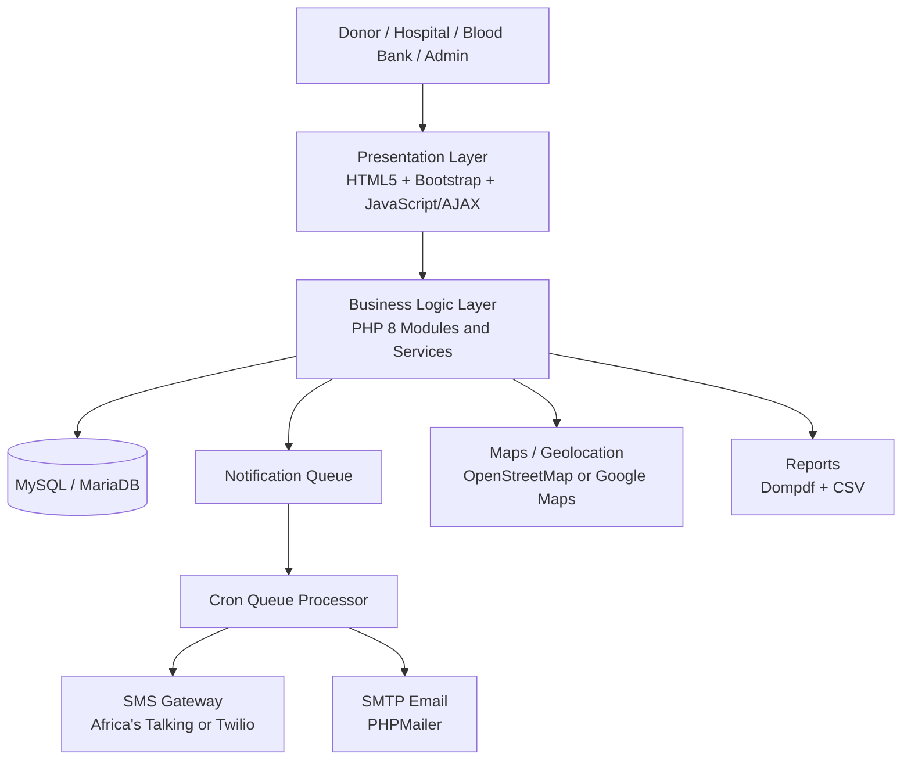
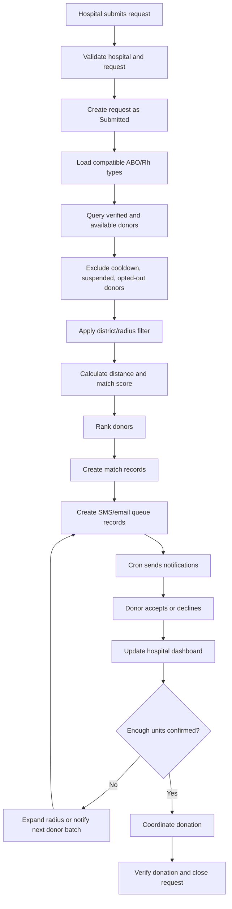

# Automated Emergency Blood Matching Platform
## Software Requirements and Technical Specification

**Project type:** Final Year Project  
**Case study:** Tanzania National Blood Transfusion Service (NBTS)  
**Primary deployment area:** Dar es Salaam, Tanzania  
**Development approach:** Agile, 16-week delivery plan  
**System type:** Responsive web application

---

## 1. Purpose

The Automated Emergency Blood Matching Platform is a web-based system for connecting hospitals, blood banks, and voluntary blood donors during emergency blood requests. The system replaces manual donor searches performed through phone calls, personal contacts, and social media with a centralised donor database, automated blood compatibility matching, location-based filtering, and real-time SMS/email notifications.

The platform is intended to reduce the time required to identify and contact suitable blood donors while providing hospitals and administrators with traceable request, response, donation, and notification records.

---

## 2. Project Objectives

### 2.1 General objective

Design and develop a secure, centralised, and user-friendly platform that rapidly identifies and notifies suitable blood donors during emergencies in Tanzania.

### 2.2 Specific system objectives

1. Register and manage donors, hospitals, hospital staff, blood-bank personnel, and administrators.
2. Capture donor blood group, Rh factor, location, availability, notification preferences, and donation history.
3. Allow verified hospitals to submit emergency blood requests.
4. Match requests to compatible donors using ABO and Rh compatibility rules.
5. Prioritise donors by proximity to the requesting hospital.
6. Notify matched donors through SMS and email.
7. Record donor responses as accepted, declined, pending, expired, or cancelled.
8. Provide real-time request progress and response tracking for hospital staff.
9. Maintain audit logs and notification delivery logs.
10. Provide dashboards, analytics, PDF reports, and spreadsheet exports.
11. Enforce role-based access control and secure data handling.
12. Support low-bandwidth and mobile-device access.

---

## 3. Scope

### 3.1 Included in the MVP

- Donor registration and profile management
- Hospital registration and verification
- Hospital staff account management
- Blood-bank personnel accounts
- Administrator accounts
- Authentication and password recovery
- Role-based access control
- Donor availability management
- Emergency blood request creation and management
- ABO and Rh compatibility matching
- Region/district and radius-based donor filtering
- SMS and email notification queues
- Donor response capture
- Request status tracking
- Donation history recording and verification
- Administrative analytics dashboard
- Notification and activity logs
- PDF report generation
- Excel/CSV export
- Responsive desktop, tablet, and mobile interfaces

### 3.2 Excluded from the MVP

- Native Android or iOS applications
- Integration with existing hospital management systems
- Integration with the national blood-bank database
- Ambulance dispatch or emergency-response integrations
- Financial accounting and billing
- Full blood-bank inventory management
- Laboratory test result management
- Automated medical eligibility approval
- Integration with wearable devices
- AI-based diagnosis or medical recommendations

---

## 4. Stakeholders and User Roles

### 4.1 Donor

A voluntary blood donor who can:

- Create and verify an account
- Maintain personal and contact details
- Record blood group and Rh factor
- Set region, district, and optional geolocation
- Choose SMS, email, or both notification methods
- Set availability status
- Receive emergency requests
- Accept or decline requests
- View donation history
- Temporarily pause notifications
- Withdraw consent or deactivate the account

### 4.2 Hospital staff

A verified staff member belonging to a registered hospital who can:

- Sign in under a hospital account
- Create emergency blood requests
- View matching results
- Monitor donor responses
- Close, cancel, or fulfil a request
- Contact donors who accepted
- Record whether a donor arrived and donated
- Generate request reports

### 4.3 Blood-bank personnel

An authorised blood-bank user who can:

- Review and verify hospital registrations
- Review donation records
- Confirm completed donations
- Coordinate donor and hospital activities
- View request and donor statistics
- Generate operational reports

### 4.4 System administrator

A platform administrator who can:

- Manage all users, hospitals, and blood-bank accounts
- Approve, suspend, or deactivate accounts
- Configure blood compatibility rules
- Configure request urgency levels
- Configure location radius rules
- Manage notification templates
- View audit and security logs
- View system-wide analytics
- Retry failed notifications
- Configure global system settings

---

## 5. Functional Requirements

### FR-001: User registration

The system shall allow donors and hospital representatives to register through separate registration flows.

**Donor registration data:**

- Full name
- Date of birth
- Gender, where required by approved policy
- Phone number
- Email address, optional if SMS is available
- Password
- Blood group
- Rh factor
- Region
- District
- Physical address, optional
- Latitude and longitude, optional
- Preferred notification channel
- Consent to data processing and emergency communication

**Hospital registration data:**

- Hospital name
- Registration or licence number
- Contact person
- Official email
- Phone number
- Address
- Region
- District
- Latitude and longitude
- Supporting verification information

### FR-002: Account verification

- Donor phone numbers shall be verified using a one-time code where SMS credits are available.
- Email verification shall be supported.
- Hospital accounts shall remain pending until verified by an administrator or blood-bank officer.
- Unverified hospitals shall not create emergency requests.

### FR-003: Authentication

The platform shall support:

- Email or phone plus password login
- Secure logout
- Password reset through email or SMS
- Session expiry
- Login-attempt throttling
- Optional account lock after repeated failures

### FR-004: Donor profile management

A donor shall be able to update:

- Contact details
- Location
- Availability
- Notification preferences
- Emergency contact, optional
- Preferred donation distance

Blood group and Rh factor changes shall require administrative or authorised medical verification once the account has been verified.

### FR-005: Donor availability

Availability states shall include:

- Available
- Temporarily unavailable
- Recently donated / cooldown
- Suspended
- Inactive

A donor in an unavailable, suspended, inactive, or cooldown state shall not be included in normal matching results.

### FR-006: Hospital profile management

Verified hospital users shall manage hospital contact details and approved staff accounts. Critical identity fields, such as registration number, shall require re-verification when changed.

### FR-007: Emergency blood request creation

A hospital user shall submit:

- Patient reference code rather than full patient name where possible
- Blood group required
- Rh factor required
- Number of units
- Urgency level
- Reason/category
- Required-by date and time
- Hospital location
- Additional clinical coordination notes

The system shall validate all required fields before saving the request.

### FR-008: Request lifecycle

Request statuses:

- Draft
- Submitted
- Matching
- Notifying
- Active
- Partially fulfilled
- Fulfilled
- Expired
- Cancelled

Every status transition shall be logged with user, date, and time.

### FR-009: Blood compatibility matching

The matching engine shall identify donors who are compatible with the requested blood type.

#### Red-cell donor compatibility matrix

| Recipient needs | Compatible donor groups |
|---|---|
| O- | O- |
| O+ | O-, O+ |
| A- | O-, A- |
| A+ | O-, O+, A-, A+ |
| B- | O-, B- |
| B+ | O-, O+, B-, B+ |
| AB- | O-, A-, B-, AB- |
| AB+ | All ABO/Rh groups |

The matrix shall be configurable by an administrator and reviewed by qualified clinical personnel before production use.

### FR-010: Matching filters

A donor shall be eligible when:

- Account is active and verified
- Blood group is compatible
- Availability is set to available
- Donor is not in a configured donation cooldown period
- Donor has consented to notifications
- Donor is within the configured geographic area
- Donor has not already declined or responded to the same request

### FR-011: Match ranking

Eligible donors shall be ranked using:

1. Exact blood-group match
2. Distance from hospital
3. Current availability
4. Time since last donation
5. Previous response reliability
6. Preferred notification channel availability

A simple score may be used:

```text
match_score = compatibility_score
            + distance_score
            + availability_score
            + donation_interval_score
            + response_reliability_score
```

The score shall support explanation fields so administrators can understand why a donor was selected.

### FR-012: Location-based filtering

The platform shall:

- Store hospital latitude and longitude
- Store donor latitude and longitude when permission is granted
- Fall back to district/region matching when precise geolocation is unavailable
- Use the Haversine formula or mapping-provider distance service
- Support configurable search radii, for example 5 km, 10 km, 25 km, and 50 km
- Expand the radius automatically when insufficient donors are found

### FR-013: Notification generation

When a request becomes active, the system shall create notification jobs for matched donors.

Notification content shall include:

- Blood group needed
- Hospital name
- General hospital location
- Urgency
- Request reference
- Required response action
- Expiry time
- Contact or secure response link

Sensitive patient details shall not be included in SMS or email.

### FR-014: Notification queue

Each SMS and email shall be inserted into a queue table and processed asynchronously by a cron job.

Queue states:

- Pending
- Processing
- Sent
- Delivered, where provider feedback exists
- Failed
- Retry scheduled
- Cancelled

The system shall retry transient failures using configurable retry intervals and shall stop after a configured maximum number of attempts.

### FR-015: Donor response

A donor shall accept or decline through:

- Secure web link
- Donor portal
- Optional SMS response, where supported

The response shall record:

- Request
- Donor
- Response status
- Response time
- Optional notes
- Source channel

### FR-016: Hospital real-time updates

The hospital dashboard shall display new donor responses using AJAX polling at a configurable interval. Full WebSocket support is not required for the MVP.

### FR-017: Donor contact disclosure

Donor contact details shall only be revealed to authorised hospital staff after the donor accepts the request, subject to consent and privacy policy.

### FR-018: Donation completion

Hospital staff or blood-bank personnel shall record:

- Donor arrival status
- Donation date and time
- Units donated
- Verification officer
- Completion notes

The donor history and request fulfilment totals shall update automatically.

### FR-019: Administrative dashboard

The dashboard shall show:

- Total registered donors
- Active and available donors
- Donors by blood group
- Donors by region and district
- Open emergency requests
- Fulfilled, cancelled, and expired requests
- Average matching time
- Average first-response time
- Notification success/failure rate
- Donation completion rate
- Recent system activity

### FR-020: Reporting

Reports shall include:

- Emergency request summary
- Requests by period, hospital, urgency, status, and blood group
- Donor registration report
- Donor availability report
- Donation history report
- Notification delivery report
- Response-time report
- System audit report

Output formats:

- On-screen table
- PDF
- CSV/Excel-compatible export

### FR-021: Audit logging

The system shall log:

- Authentication attempts
- User creation and updates
- Hospital verification decisions
- Emergency request creation and changes
- Matching execution
- Notification processing
- Donor responses
- Donation verification
- Administrative settings changes

### FR-022: Search and filtering

Users shall search and filter records by:

- Reference number
- Blood group
- Date range
- Region or district
- Hospital
- Request status
- Donor response status
- Notification delivery status

---

## 6. Non-Functional Requirements

### NFR-001: Performance

- Standard pages should load within 3 seconds on a typical mobile connection.
- Matching of up to 100,000 donor records should complete within 10 seconds with proper indexes and staged filtering.
- User-facing request submission shall not wait for SMS/email delivery.
- Dashboard queries shall use indexed filters and pagination.

### NFR-002: Availability

- Target pilot availability: 99% excluding scheduled maintenance.
- Daily database backups shall be maintained.
- The system shall recover gracefully from SMS/email provider outages.

### NFR-003: Scalability

The design shall support future expansion from Dar es Salaam to all regions of Tanzania by using:

- Region/district reference tables
- Indexed donor matching fields
- Queue-based notifications
- Pagination
- Stateless PHP request handling
- Configurable providers

### NFR-004: Security

- Passwords hashed using `password_hash()` with bcrypt or Argon2id where supported
- Prepared SQL statements through PDO
- CSRF protection on state-changing forms
- Strict server-side validation
- Output escaping to prevent XSS
- Secure, HTTP-only, SameSite cookies
- HTTPS in all deployed environments
- Role and permission checks on every protected action
- Rate limiting for login, password reset, and public response links
- Secrets stored outside source control in `.env`
- Audit logs protected from ordinary users
- Database account granted minimum required privileges

### NFR-005: Privacy

- Collect only necessary donor and patient coordination information.
- Use a patient reference code instead of full patient identity where possible.
- Obtain donor consent for notifications and location usage.
- Support opt-out and account deactivation.
- Restrict contact disclosure until a donor accepts.
- Define retention periods for requests, logs, and inactive accounts.
- Provide a clear privacy notice.

### NFR-006: Usability

- Mobile-first interface
- Clear emergency request workflow
- Large touch targets
- Plain language labels
- Confirmation prompts for cancellation and fulfilment actions
- Accessible forms with labels and error messages
- Consistent status colours and badges

### NFR-007: Compatibility

Supported browsers:

- Latest Chrome
- Latest Firefox
- Latest Edge
- Safari on current iOS/macOS versions
- Common Android mobile browsers

### NFR-008: Maintainability

Even though the proposal specifies procedural PHP, the codebase shall be organised into modules with reusable functions, services, repositories, templates, and configuration files rather than placing all logic directly inside page scripts.

### NFR-009: Low-bandwidth support

- Compress images and static assets
- Avoid heavy JavaScript frameworks
- Use server-rendered HTML
- Minify CSS and JavaScript
- Paginate large tables
- Avoid automatic map loading until requested
- Provide SMS as the primary urgent channel

---

## 7. Recommended System Architecture

### 7.1 Three-tier architecture



### 7.2 Suggested PHP module structure

```text
/app
  /config
  /controllers
  /services
  /repositories
  /models
  /middleware
  /validation
  /views
  /helpers
  /jobs
  /reports
/public
  index.php
  /assets
/routes
/storage
  /logs
  /exports
  /cache
/database
  /migrations
  /seeders
/cron
  process_notifications.php
  expire_requests.php
  create_backups.php
/vendor
.env
composer.json
```

---

## 8. Technology Stack and Tools

### 8.1 Core application stack

| Area | Technology | Purpose |
|---|---|---|
| Backend | PHP 8+ | Authentication, business logic, matching, request workflows, RBAC |
| Database access | PDO | Prepared queries and transaction handling |
| Database | MySQL 8 or MariaDB 10.6+ | Relational data storage |
| Storage engine | InnoDB | Transactions and foreign keys |
| Character set | utf8mb4 | Full Unicode support |
| Frontend | HTML5, CSS3 | Page structure and styling |
| UI framework | Bootstrap 5.3 | Responsive mobile-first interface |
| Client scripting | Vanilla JavaScript | Form behaviour and interactivity |
| Async requests | Fetch API or AJAX | Live dashboard and response updates |
| Charts | Chart.js | Analytics visualisation |
| PDF reports | Dompdf | PDF generation |
| Email | PHPMailer + SMTP | Transactional email delivery |
| SMS | Africa's Talking or Twilio | Emergency donor alerts |
| Maps | OpenStreetMap + Leaflet preferred; Google Maps optional | Location capture and distance display |
| Scheduling | Linux cron | Queue processing, expiry tasks, and backups |
| Dependency management | Composer | PHP package management |

### 8.2 Development tools

| Tool | Purpose |
|---|---|
| Visual Studio Code | Source-code editing |
| XAMPP, MAMP, Laragon, or Docker | Local PHP/MySQL development environment |
| Git | Version control |
| GitHub or GitLab | Remote repository and issue tracking |
| Composer | Dependency installation |
| phpMyAdmin or Adminer | Database inspection |
| Postman or Bruno | Endpoint and form-action testing |
| Figma | Wireframes and interface prototypes |
| Draw.io / diagrams.net | Use-case, ERD, and architecture diagrams |
| PHPUnit | Unit tests where practical |
| PHP_CodeSniffer | PHP coding standards |
| PHPStan | Static analysis, optional but recommended |
| OWASP ZAP | Basic web security testing |
| Apache JMeter or k6 | Performance testing |
| Browser DevTools | Responsive and network testing |

### 8.3 Recommended provider choices for the MVP

- **SMS:** Africa's Talking as the first option because of its regional focus and Tanzanian number support; retain Twilio behind a provider interface as a fallback.
- **Maps:** OpenStreetMap with Leaflet to reduce cost and avoid early dependency on paid map usage. Use stored coordinates and the Haversine formula for matching.
- **Email:** A reliable SMTP account through the hosting provider or a transactional email provider.
- **Hosting:** A small VPS is preferred over basic shared hosting because cron jobs, logs, queues, SSL, and future scaling are easier to control. Shared hosting remains acceptable for academic demonstration.

---

## 9. Database Specification

### 9.1 Main tables

#### `users`

- `id` BIGINT PK
- `full_name` VARCHAR(150)
- `email` VARCHAR(190) UNIQUE NULL
- `phone` VARCHAR(30) UNIQUE
- `password_hash` VARCHAR(255)
- `role_id` BIGINT FK
- `status` ENUM(active, pending, suspended, inactive)
- `email_verified_at` DATETIME NULL
- `phone_verified_at` DATETIME NULL
- `last_login_at` DATETIME NULL
- `created_at`, `updated_at`

#### `roles`

- `id`
- `name` UNIQUE
- `description`

#### `permissions`

- `id`
- `name` UNIQUE
- `description`

#### `role_permissions`

- `role_id`
- `permission_id`
- Composite primary key

#### `donor_profiles`

- `id`
- `user_id` UNIQUE FK
- `date_of_birth` DATE NULL
- `blood_group` ENUM(O, A, B, AB)
- `rh_factor` ENUM(positive, negative)
- `blood_type_verified_at` DATETIME NULL
- `availability_status`
- `preferred_radius_km` INT DEFAULT 25
- `last_donation_date` DATE NULL
- `notification_sms` BOOLEAN
- `notification_email` BOOLEAN
- `consent_at` DATETIME
- `created_at`, `updated_at`

#### `locations`

- `id`
- `region`
- `district`
- `ward` NULL
- `address` NULL
- `latitude` DECIMAL(10,7) NULL
- `longitude` DECIMAL(10,7) NULL
- Index on region and district

#### `donor_locations`

- `donor_id` FK
- `location_id` FK
- `is_current`
- `updated_at`

#### `hospitals`

- `id`
- `name`
- `registration_number` UNIQUE
- `official_email`
- `phone`
- `location_id` FK
- `verification_status`
- `verified_by` FK NULL
- `verified_at` DATETIME NULL
- `created_at`, `updated_at`

#### `hospital_users`

- `hospital_id` FK
- `user_id` FK
- `job_title` NULL
- `status`
- Composite unique key

#### `emergency_requests`

- `id`
- `reference_number` UNIQUE
- `hospital_id` FK
- `created_by` FK
- `patient_reference` VARCHAR(100)
- `blood_group_needed`
- `rh_factor_needed`
- `units_needed`
- `units_fulfilled` DEFAULT 0
- `urgency_level`
- `reason_category`
- `required_by`
- `status`
- `notes` TEXT NULL
- `submitted_at`
- `closed_at` NULL
- `created_at`, `updated_at`

#### `request_status_history`

- `id`
- `request_id` FK
- `old_status`
- `new_status`
- `changed_by` FK
- `notes` NULL
- `created_at`

#### `matches`

- `id`
- `request_id` FK
- `donor_id` FK
- `compatibility_type`
- `distance_km` DECIMAL(8,2) NULL
- `match_score` DECIMAL(8,2)
- `rank_number` INT
- `status`
- `created_at`
- Unique (`request_id`, `donor_id`)

#### `donor_responses`

- `id`
- `request_id` FK
- `donor_id` FK
- `match_id` FK
- `response_status`
- `response_channel`
- `notes` NULL
- `responded_at` NULL
- `created_at`, `updated_at`
- Unique (`request_id`, `donor_id`)

#### `notifications`

- `id`
- `request_id` FK NULL
- `recipient_user_id` FK
- `channel` ENUM(sms, email)
- `template_key`
- `subject` NULL
- `message` TEXT
- `status`
- `provider`
- `provider_message_id` NULL
- `attempt_count`
- `next_attempt_at` NULL
- `sent_at` NULL
- `delivered_at` NULL
- `failure_reason` NULL
- `created_at`, `updated_at`

#### `donations`

- `id`
- `request_id` FK NULL
- `donor_id` FK
- `hospital_id` FK
- `units_donated`
- `donation_date`
- `verification_status`
- `verified_by` FK NULL
- `verified_at` NULL
- `notes` NULL
- `created_at`, `updated_at`

#### `audit_logs`

- `id`
- `user_id` FK NULL
- `action`
- `entity_type`
- `entity_id` NULL
- `ip_address`
- `user_agent`
- `metadata_json` JSON NULL
- `created_at`

#### `system_settings`

- `id`
- `setting_key` UNIQUE
- `setting_value` TEXT
- `is_secret` BOOLEAN
- `updated_by` FK
- `updated_at`

### 9.2 Important indexes

- Donor blood group + Rh factor + availability
- Donor last donation date
- Donor region + district
- Hospital verification status
- Emergency request status + required-by time
- Match request ID + score
- Notification status + next attempt time
- Donor response request ID + status
- Audit log user ID + date

---

## 10. Matching Workflow



### 10.1 Batch notification strategy

To avoid contacting every compatible donor at once:

1. Notify the nearest first batch, such as 10 donors.
2. Wait for a configurable response period.
3. If insufficient acceptances are received, notify the next ranked batch.
4. Stop further notifications when the request is fulfilled or cancelled.
5. Send a cancellation/closure message to donors who accepted when appropriate.

---

## 11. Page and Interface Specification

### Public pages

- Home
- About the platform
- How donation matching works
- Donor registration
- Hospital registration
- Login
- Forgot password
- Privacy policy
- Terms of use
- Contact/support

### Donor portal

- Dashboard
- Profile
- Availability toggle
- Emergency requests
- Request details and response
- Donation history
- Notification preferences
- Security settings

### Hospital portal

- Dashboard
- Create emergency request
- Active requests
- Request details
- Matching results
- Donor responses
- Donation completion
- Reports
- Hospital profile
- Staff accounts

### Blood-bank portal

- Dashboard
- Hospital verification queue
- Donation verification queue
- Requests overview
- Donor statistics
- Operational reports

### Administrator portal

- System dashboard
- Users
- Donors
- Hospitals
- Blood-bank accounts
- Emergency requests
- Matches
- Notifications
- Reports
- Audit logs
- Notification templates
- System settings

---

## 12. Key Server Actions / Endpoint Plan

The application may use server-rendered routes with AJAX endpoints.

### Authentication

- `POST /register/donor`
- `POST /register/hospital`
- `POST /login`
- `POST /logout`
- `POST /password/forgot`
- `POST /password/reset`

### Donor

- `GET /donor/dashboard`
- `GET|POST /donor/profile`
- `POST /donor/availability`
- `GET /donor/requests`
- `POST /donor/requests/{id}/respond`
- `GET /donor/donations`

### Hospital

- `GET /hospital/dashboard`
- `POST /hospital/requests`
- `GET /hospital/requests/{id}`
- `POST /hospital/requests/{id}/submit`
- `POST /hospital/requests/{id}/cancel`
- `POST /hospital/requests/{id}/complete`
- `GET /hospital/requests/{id}/responses`

### Admin/blood bank

- `POST /admin/hospitals/{id}/verify`
- `POST /admin/hospitals/{id}/reject`
- `POST /admin/users/{id}/suspend`
- `GET /admin/notifications`
- `POST /admin/notifications/{id}/retry`
- `GET /admin/reports/{report}`

### Background jobs

- `cron/process_notifications.php`
- `cron/expire_requests.php`
- `cron/recalculate_donor_availability.php`
- `cron/database_backup.php`

---

## 13. Validation and Business Rules

1. Phone numbers shall be normalised to E.164 format, for example `+255...`.
2. A verified hospital is required to submit an emergency request.
3. Units required must be a positive integer.
4. Required-by time must be in the future when the request is submitted.
5. Donors shall not edit verified blood type without re-verification.
6. Donors within the configured post-donation cooldown shall not be matched.
7. A donor shall respond only once per request unless an authorised user resets the response.
8. A fulfilled, expired, or cancelled request shall not generate new notifications.
9. Notification content shall not expose patient identity.
10. Every administrative action shall be audited.
11. Deactivated donors shall not receive notifications.
12. Matching shall be rerunnable without creating duplicate match or notification records.

---

## 14. Security Design

### Authentication and sessions

- Regenerate session ID after successful login.
- Enforce inactivity timeout.
- Invalidate sessions on password change.
- Store reset tokens as hashes with expiry times.
- Do not disclose whether a phone/email exists during password recovery.

### Input and output security

- Validate all data server-side.
- Use PDO prepared statements only.
- Escape rendered user content.
- Validate uploads by MIME type and size if hospital documents are uploaded.
- Store uploads outside the public web root where possible.

### Access control

Permissions should be checked in middleware or a shared authorisation function before the controller/action executes.

Example permissions:

- `donor.profile.update`
- `donor.request.respond`
- `hospital.request.create`
- `hospital.request.view_own`
- `hospital.request.complete`
- `bloodbank.hospital.verify`
- `admin.user.manage`
- `admin.settings.manage`
- `admin.audit.view`

### Data protection

- Encrypt backups.
- Restrict production database access.
- Redact sensitive values from logs.
- Use HTTPS and secure cookies.
- Record consent version and timestamp.
- Document retention and deletion policies.

---

## 15. Testing Plan

### Unit testing

- ABO/Rh compatibility rules
- Match-score calculation
- Distance calculation
- Request status transitions
- Donor cooldown rules
- Notification retry rules

### Integration testing

- Registration and verification
- Login and RBAC
- Emergency request to matching pipeline
- SMS provider integration using sandbox/test mode
- SMTP email delivery
- Donation completion and request fulfilment
- PDF and CSV export

### User acceptance testing

Participants:

- Donors
- Hospital staff
- Blood-bank personnel
- Administrators

Scenarios:

- Register donor
- Register and verify hospital
- Submit urgent request
- Match and notify donors
- Accept request
- Complete donation
- Generate report

### Performance testing

- Match queries with 1,000, 10,000, and 100,000 simulated donors
- Notification queue processing under batch load
- Concurrent dashboard polling
- Large report generation

### Security testing

- SQL injection
- Cross-site scripting
- CSRF
- Broken access control
- Session fixation
- Brute-force login attempts
- Insecure direct object references
- Sensitive-data leakage in logs and notifications

---

## 16. Deployment Specification

### Minimum server requirements

- Linux server
- Apache 2.4 or Nginx
- PHP 8.1+
- MySQL 8 or MariaDB 10.6+
- Composer
- Cron support
- SSL certificate
- At least 1 GB RAM for pilot deployment
- Daily backup storage

### Environments

- Local development
- Testing/staging
- Production/pilot

### Deployment checklist

1. Provision domain and SSL.
2. Create database and restricted database user.
3. Configure `.env` values.
4. Run database migrations and seed reference data.
5. Configure SMS provider.
6. Configure SMTP.
7. Configure cron jobs.
8. Configure log rotation.
9. Enable automated backups.
10. Run smoke and security tests.
11. Create initial administrator.
12. Train pilot users.

---

## 17. Observability and Operations

The platform shall maintain:

- Application error log
- Notification job log
- SMS/email provider response log
- Security event log
- Audit log
- Backup log

Recommended alerts:

- Repeated notification failures
- Cron job not running
- Disk space low
- Database connection failures
- High number of failed logins
- Unusually high request creation rate

---

## 18. Agile Delivery Plan

### Weeks 1–2: Requirements

- Stakeholder interviews
- Questionnaires
- Existing-process observation
- Requirements validation

### Weeks 3–4: Design

- Architecture
- ERD
- Wireframes
- Use-case diagrams
- Security and privacy review

### Week 5: Sprint 1

- User registration
- Authentication
- Donor and hospital profiles

### Week 6: Sprint 2

- Emergency request management
- Hospital dashboard

### Weeks 7–8: Sprint 3

- Compatibility engine
- Location filtering
- Match ranking

### Weeks 9–10: Sprint 4

- SMS/email integration
- Queue processor
- Templates and retry logic

### Week 11: Sprint 5

- Donor responses
- AJAX updates
- Donation coordination

### Weeks 12–13: Sprint 6

- Administrative dashboard
- Charts
- PDF and CSV reports

### Weeks 14–15: Testing

- Unit, integration, performance, security, and acceptance testing

### Week 16: Deployment and documentation

- Pilot deployment
- Training
- Final documentation
- Evaluation and handover

---

## 19. Acceptance Criteria

The MVP shall be accepted when:

1. Donors can register, verify, log in, and maintain availability.
2. Hospitals can register and are blocked from requesting blood until verified.
3. A verified hospital can submit an emergency request.
4. The system returns only compatible and eligible donors.
5. Donors are ranked by proximity and configured matching rules.
6. SMS/email notifications are queued rather than sent inside the request transaction.
7. Donors can accept or decline through a secure flow.
8. Hospital users can see responses without manually refreshing the entire page.
9. Completed donations update donor history and request fulfilment.
10. Administrators can view analytics, logs, and reports.
11. RBAC prevents users from accessing unauthorised records or actions.
12. PDF and CSV reports can be generated.
13. All critical workflows pass user-acceptance testing.

---

## 20. Future Enhancements

- Native Android and iOS applications
- USSD/SMS-only donor interaction
- Integration with NBTS systems
- Integration with hospital information systems
- Blood-bank inventory management
- Multi-language support, including Kiswahili
- Push notifications
- Advanced geospatial search
- Predictive blood-demand analytics
- Donor campaigns and appointment scheduling
- Donor badges and engagement features
- Multi-provider SMS failover
- National identity or health-worker verification integrations, subject to law and approval

---

## 21. Important Clinical and Governance Note

This platform supports donor discovery, communication, and coordination. It must not independently determine whether a donor is medically eligible or whether donated blood is safe for transfusion. Final donor screening, laboratory testing, compatibility confirmation, collection, storage, and transfusion decisions remain the responsibility of qualified healthcare and blood-transfusion professionals under approved Tanzanian procedures.
